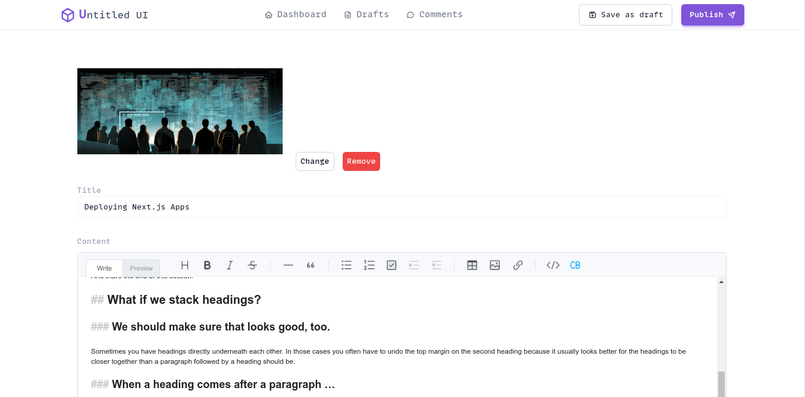
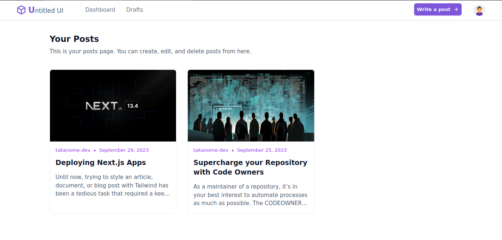

<h1 align="center">Astro Blog with Golang</h1>

<p align="center">
 <a href="https://github.com/takanome-dev/blog-with-astro-golang/blob/main/LICENSE">
    
  </a>
 <a href="https://github.com/takanome-dev/blog-with-astro-golang/actions/workflows/codeql.yml">
    
  </a>

</p>

## :construction: Status :construction:

This blog app is currently _early_ in the development cycle. It's not yet functional but is being actively developed.

```bash
If you like this project, please leave a star ⭐ It's free and helps a lot!
```

<details>
  <summary>Screenshots</summary>
  <div>
    
    
    
  </div>
</details>

## :desktop_computer: Local development

**Prerequisite**

You will need to have installed the following:

- [Golang](https://go.dev/dl/) (version 1.21 or higher)
- [PNPM](https://pnpm.io/installation) (version 8.6.0 or higher)
- [PostgreSQL](https://www.postgresql.org/download/) (version 13 or higher)
- [Make](https://www.gnu.org/software/make/) (version 4.3 or higher)
- [Docker (optional)](https://docs.docker.com/get-docker/) (version 20.10.8 or higher)

Once you have installed the prerequisites, you can follow the steps below to start the app locally.

Step 1: Fork the [repo](https://github.com/takanome-dev/blog-with-astro-golang) on GitHub.

Step 2. Clone your forked repository to your local machine.

```bash
# using https
git clone https://github.com/<your_username>/blog-with-astro-golang.git

# using ssh
git clone git@github.com:<your_username>/blog-with-astro-golang.git
```

Step 3. Navigate to the cloned directory and install the dependencies.

```bash
cd blog-with-astro-golang

# install dependencies for the client
cd client && pnpm install

# install dependencies for the server
cd server && make install
```

Step 4. Create a `.env` file

```bash
# create a .env file for the client
cd client && cp .env.example .env

# create a .env file for the server
cd server && cp .env.example .env
```

Replace the placeholder values in the `.env` file with your own values.

Step 5. You will need to run the migrations to create the database tables.

```bash
# first, create a database called `blog` or whatever you want to call it
# run `psql` to open the postgres shell
psql

# create the database
CREATE DATABASE blog;

# exit the shell
\q

# run the migrations
cd server && make migrate DB_URL=<your_database_url>
# i.e. make migrate DB_URL=postgres://<user>:<pwd>@localhost:5432/blog
```

See the next section for how to run the migrations using Docker (easier).

Step 6. Run the development server.

```bash
# run the client
cd client && pnpm dev

# run the server
cd server && make run
```

This will start the web app at [http://localhost:4321](http://localhost:4321) and the server at [http://localhost:5000](http://localhost:5000).

## :whale: Running the migrations with Docker

(TODO: Add instructions for running the client with Docker)

## :handshake: Contributing

We welcome contributions of all sizes, from small bug fixes to new features. Just check out the open issues and pull requests to see where you can make an impact.
Don't forget to read our [Contributing Guide](./CONTRIBUTING.md) to learn how you can get involved.

## ⚖️ License

The scripts and documentation in this project are released under the [MIT LICENSE](./LICENSE)
